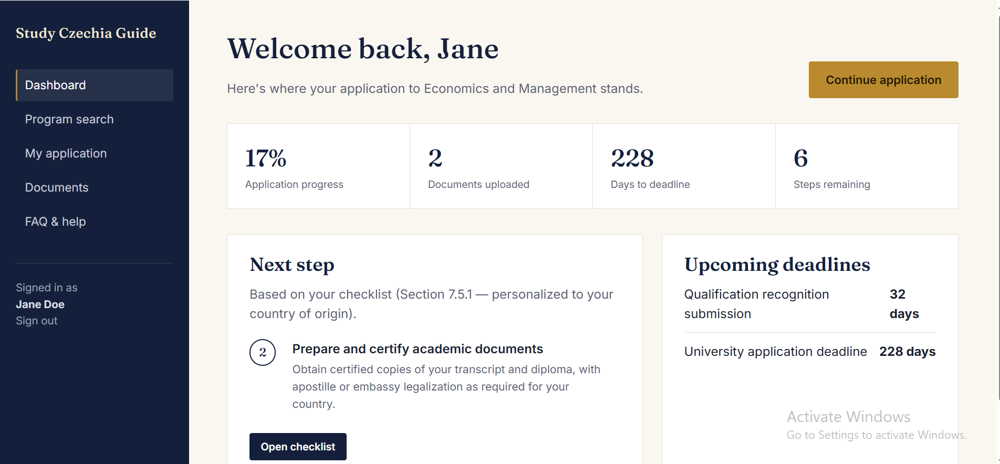
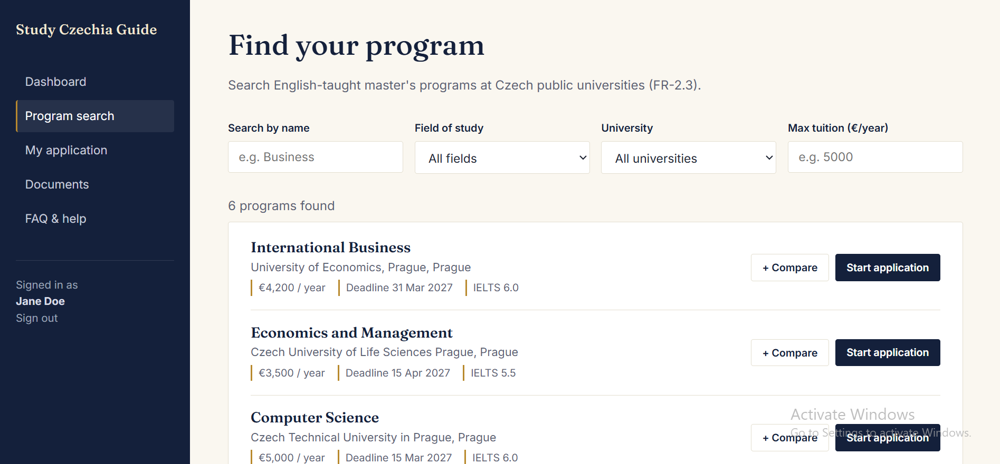
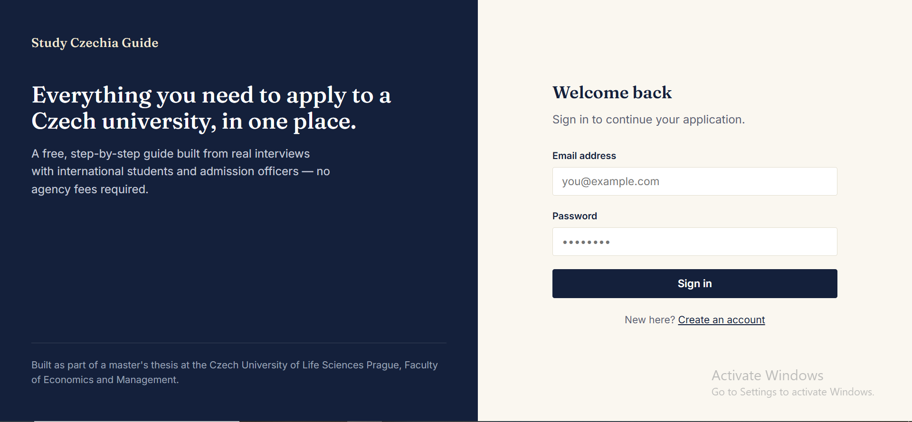
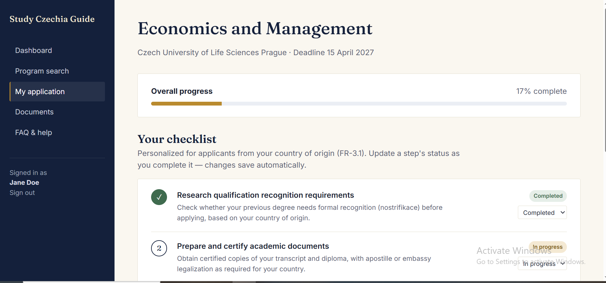
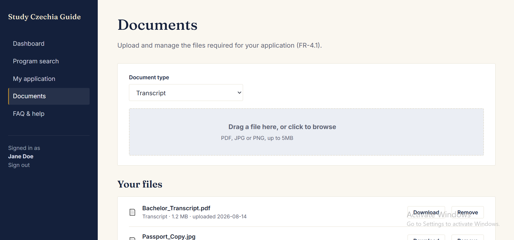

# Master's Degree Program Finder & Application Management System

An interactive web application developed as part of a Master's Thesis project at the **Czech University of Life Sciences Prague (CZU)**. This platform helps students search, filter, and compare English-taught Master's degree programs available across public universities in the Czech Republic, as well as manage their application checklists and document submissions.

---

## 📸 Screenshots & Application Flow

Below are the key interfaces of the platform:

### 1. Dashboard

*Overview of student applications, active program statuses, and quick navigation.*

### 2. Program Search & Filtering

*Search and filter English-taught Master's programs across universities with dynamic filtering.*

### 3. User Authentication

*Secure user authentication portal for applicants and administrators.*

### 4. Application Checklist

*Track required documents, admission deadlines, and application steps.*

### 5. Document Upload Interface

*Interface for uploading, managing, and verifying required application documents.*

---

## 🛠️ Tech Stack

- **Backend:** PHP, Laravel Framework
- **Frontend:** Blade Templates, jQuery, JavaScript, CSS3 / Bootstrap
- **Database:** MySQL
- **Build Tool:** Webpack / Laravel Mix

---

## 🚀 Key Features

- 🔍 **Advanced Program Search:** Search study programs by keywords, discipline, or university name.
- 🎯 **Dynamic Filtering:** Filter results instantaneously based on language, study mode (full-time/part-time), tuition fee, and location.
- 📋 **Application Checklist:** Track application status and missing documents step-by-step.
- 📂 **Document Management:** Easily upload and review necessary academic credentials.
- 📱 **Responsive Design:** Fully responsive layout optimized for mobile and desktop screens.

---

## 💻 Installation & Setup

To run this project locally:

1. **Clone the repository:**
   ```bash
   git clone [https://github.com/haidercse/czu_thesis_project.git](https://github.com/haidercse/czu_thesis_project.git)
   cd czu_thesis_project
